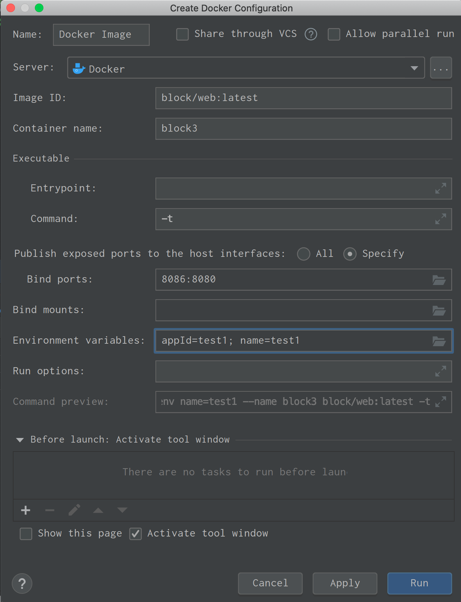

# docker配置

## pom文件配置

```
 <plugin>
                <!--该插件主要用途：构建可执行的JAR -->
                <groupId>org.springframework.boot</groupId>
                <artifactId>spring-boot-maven-plugin</artifactId>
            </plugin>
            <!--使用docker-maven-plugin插件-->
            <plugin>
                <groupId>com.spotify</groupId>
                <artifactId>docker-maven-plugin</artifactId>
                <version>1.0.0</version>

                <!--将插件绑定在某个phase执行-->
                <executions>
                    <execution>
                        <id>build-image</id>
                        <!--将插件绑定在package这个phase上。也就是说，用户只需执行mvn package ，就会自动执行mvn docker:build-->
                        <phase>package</phase>
                        <goals>
                            <goal>build</goal>
                        </goals>
                    </execution>
                </executions>

                <configuration>
                    <!--指定生成的镜像名-->
                    <imageName>block/${project.artifactId}</imageName>
                    <!--指定标签-->
                    <imageTags>
                        <imageTag>latest</imageTag>
                    </imageTags>
                    <!-- 指定 Dockerfile 路径-->
                    <dockerDirectory>${project.basedir}/src/main/docker</dockerDirectory>

                    <!--指定远程 docker api地址-->
                    <dockerHost>docker api 地址</dockerHost>

                    <!-- 这里是复制 jar 包到 docker 容器指定目录配置 -->
                    <resources>
                        <resource>
                            <targetPath>/</targetPath>
                            <!--jar 包所在的路径  此处配置的 即对应 target 目录-->
                            <directory>${project.build.directory}</directory>
                            <!-- 需要包含的 jar包 ，这里对应的是 Dockerfile中添加的文件名　-->
                            <include>${project.build.finalName}.jar</include>
                        </resource>
                    </resources>
                </configuration>
            </plugin>
```

## 操作

1. 生成jar包并生成镜像上传至docker服务器
```
 mvn clean package -Dmaven.test.skip=true
```
2. 根据镜像生成容器并启动
